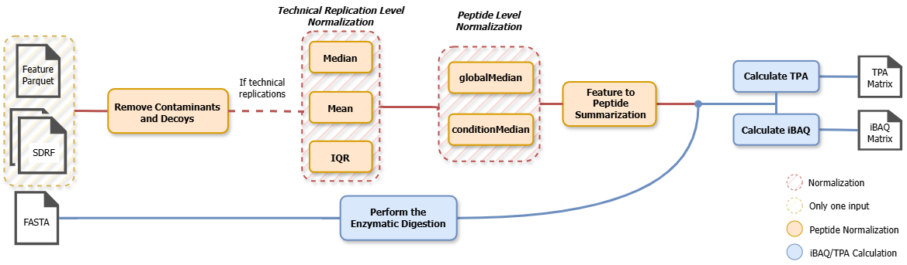

# ibaqpy

[](https://github.com/bigbio/ibaqpy/actions/workflows/python-app.yml)
[](https://github.com/bigbio/ibaqpy/actions/workflows/python-publish.yml)
[](https://app.codacy.com/gh/bigbio/ibaqpy/dashboard?utm_source=gh&utm_medium=referral&utm_content=&utm_campaign=Badge_grade)
[](https://badge.fury.io/py/ibaqpy)


iBAQ (Intensity-Based Absolute Quantification) determines the abundance of a protein by dividing the total precursor intensities by the number of theoretically observable peptides of the protein [manuscript here](https://pubmed.ncbi.nlm.nih.gov/16219938/). ibaqpy is a Python package that computes iBAQ values starting from a feature parquet from [quantmsio](https://github.com/bigbio/quantms.io) and a [SDRF](https://github.com/bigbio/proteomics-sample-metadata) file. In addition, the package computes other ibaq values including rIBAQ, log2, and ppb.

ibaqpy also allows computing the TPA value (Total Protein Approach). TPA is determined by summing peptide intensities of each protein and then dividing by the molecular mass to determine the relative concentration of each protein. By using [ProteomicRuler](https://www.sciencedirect.com/science/article/pii/S1535947620337749), it is possible to calculate the protein copy number and absolute concentration. The OpenMS tool was used to calculate the theoretical molecular mass of each protein. Similar to the calculation of IBAQ, the TPA value of protein-group was the sum of its intensity divided by the sum of the theoretical molecular mass.


### Overview of ibaq-base values computation

As mentioned before, ibaq values are calculated by dividing the total precursor intensities by the number of theoretically observable peptides of the protein. We use the following steps to calculate the iBAQ values:

- _Observable peptides_, the protein sequence is digested in silico using a specific enzyme. The current version of this tool uses OpenMS method to load fasta file, and use [ProteaseDigestion](https://openms.de/current_doxygen/html/classOpenMS_1_1ProteaseDigestion.html) to enzyme digestion of protein sequences, and finally get the theoretical peptide number of each protein.

- _Total precursor intensities_, the total intensity of a protein is calculated by summing the intensity of all peptides that belong to the protein. The intensity values are obtained from the feature parquet file in [quantms.io](https://github.com/bigbio/quantms.io).

## TODO @PingZheng: Can you double-check that for protein group we multiply the intensity or divided? 

> Note: If protein-group exists in the peptide intensity dataframe, the intensity of all proteins in the protein-group is summed based on the above steps, and then multiplied by the number of proteins in the protein-group.

#### Other normalized IBAQ values  

- `IbaqNorm` - normalize the ibaq values using the total ibaq of the sample `ibaq / sum(ibaq)`, the sum is applied for proteins in the same _sample + condition_.


- `IbaqLog`  - The ibaq log is calculated as `10 + log10(IbaqNorm)`. This normalized ibaq value was developed [by ProteomicsDB Team](https://academic.oup.com/nar/article/46/D1/D1271/4584631).


- `IbaqPpb` - The resulted IbaqNorm is multiplied by 100M `IbaqNorm * 100'000'000`. This method was developed originally [by PRIDE Team](https://www.nature.com/articles/s41597-021-00890-2).

### From quantms to Ibaq values



The output of quantms is converted into quantms.io feature file. A feature in quantms.io is the combination of the following columns: 

- `ProteinName`: Protein name
- `Peptidoform`: Peptide sequence including post-translation modifications `(e.g. .(Acetyl)ASPDWGYDDKN(Deamidated)GPEQWSK)`
- `PrecursorCharge`: Precursor charge
- `IsotopeLabelType`: Isotope label type
- `Condition`: Condition label `(e.g. heart)`
- `BioReplicate`: Biological replicate index `(e.g. 1)`
- `Run`: Run index `(e.g. 1)`
- `Fraction`: Fraction index `(e.g. 1)`
- `Intensity`: Peptide intensity
- `SampleID`: Sample ID `(e.g. PXD003947-Sample-3)`
- `StudyID`: Study ID `(e.g. PXD003947)`. In most of the cases, the study ID is the same as the ProteomeXchange ID.

In summary, each feature is the unique combination of a peptide sequence including modifications (peptidoform), precursor charge state, condition, biological replicate, run, fraction, isotopic label type, and a given intensity. In order to go from these features into protein ibaq values, the package does the following: 

#### Data preprocessing

## TODO @PingZheng: Can you confirm that the following steps are correct?

In this section, ibaqpy will do: 
- Remove lines where intensity or study condition is empty: This could happen in the following cases: 
  - The DIA pipeline sometimes for some features releases intensities with value 0.
  - The quantms.io do not contain feature information for some conditions. This extreme case could happen when not ID/Quant was found for a given condition during the analysis.
- Parse the identifier of proteins and retain only unique peptides. 
- Low-confidence proteins were removed according to the threshold of unique peptides: We use a thershold of 2 unique peptides to consider a protein as a high-confidence protein. This parameter is applied if not specified by the user, and the default value is 2. If users want to change this threshold, they can use the `--min_unique` parameter.
- Filter decoy, contaminants, entrapment: Proteins with the following prefix are removed by default: `DECOY, CONTAMINANT, ENTRAPMENT` could be removed, by default, the filter is not applied. If users want to remove these proteins, they can use the `--remove_decoy_contaminants` parameter.
- Filter user-specified proteins: The user can provide a list of protein identifiers to remove from the analysis using the `--remove_ids` parameter. The remove ids parameters will remove proteins from the analysis that could be potential to influence the intensity normalization. For example, ALBU_HUMAN could be over expressed in human tissues, and that is why we may want to remove it when analyzing tissue data.
- Remove peptides with low frequency if `sample number > 1`: This parameter is applied always unless the user specifies the `--remove_low_frequency_peptides` parameter. The default value is 20% of the samples. If users want to change this threshold, they can use the `--remove_low_frequency_peptides` parameter.
- Intensity transformation to log: The user can specify the `--log2` parameter to transform the peptide intensity values to log2 before normalization.

> Note: At the moment, ibaqpy computes the ibaq values only based on unique peptides. Shared peptides are discarded. However, if a group of proteins share the same unique peptides (e.g., Pep1 -> Prot1;Prot2 and Pep2 -> Prot1;Prot2), the intensity of the proteins is summed and divided by the number of proteins in the group.

#### Feature normalization

## TODO @PingZheng: Can you confirm that the following steps are correct?

In this section, ibaqpy corrects the intensity of each feature MS runs in the sample, eliminating the effect between runs (including technique repetitions). It will do:

- When `MS runs > 1` in the sample, the `mean` of all average(`mean`, `median` or `iqr`) in each MS run is calculated(SampleMean)
- The ratio between SampleMean and the average MS run is used as a reference to scale the original intensity

#### Features to peptides

A peptidoform is a combination of a `PeptideSequence(Modifications) + Charge + BioReplicate + Fraction` (among other features), and a peptide is a combination of a `PeptideSequence(Canonical) + BioReplicate`. ibaqpy will do:

- Select peptidoforms with the highest intensity across different modifications, fractions, and technical replicates
- Merge peptidoforms across different charges and combined into peptides. In order to merge peptidoforms, the package will applied the `sum` of the intensity values of the peptidoforms.

#### Peptide Intensity Normalization

Finally, the intensity of the peptide was normalized globally by `globalMedian`,`conditionMedian`. In the sample, the protein was combined from its unique peptides. 

#### Computing Ibaq and TPA 

The iBAQ value was calculated as the Intensity of the protein divided by the theoretical number of unique peptides cut by the enzyme. This command also normalized iBAQ as riBAQ. See details in `peptides2proteins`.

Compute TPA values, protein copy numbers and concentration from the output file from script `commands/features2peptides`. 

**Merge projects**: Merge ibaq results from multiple datasets. It consists of three steps: missing value imputation, outlier removal, and batch effect removal. 

> Note: In all scripts and result files, *uniprot accession* is used as the protein identifier.

### How to install ibaqpy

Ibaqpy is available in PyPI and can be installed using pip:

```asciidoc
pip install ibaqpy
```

You can install the package from code:

1. Clone the repository:

```asciidoc
>$ git clone https://github.com/bigbio/ibaqpy
>$ cd ibaqpy
```

2. Install conda environment:

```asciidoc
>$ mamba env create -f conda-environment.yaml
```

3. Install ibaqpy:

```asciidoc
>$ python setup.py install
```

### Collecting intensity files from quantms.org 

Absolute quantification files have been stored in the following url:

```
http://ftp.pride.ebi.ac.uk/pub/databases/pride/resources/proteomes/absolute-expression/quantms-data/
```

Inside each project reanalysis folder, the folder proteomicslfq contains the msstats input file with the structure `{Name of the project}.{Random uuid}.feature.parquet	`. 

E.g. http://ftp.pride.ebi.ac.uk/pub/databases/pride/resources/proteomes/absolute-expression/quantms-data/MSV000079033.1/MSV000079033.1-bd44c7e3-654c-444d-9e21-0f701d6dac94.feature.parquet

### Major commands  


#### Features to peptides

```asciidoc
ibaqpy features2peptides -p tests/PXD003947/PXD003947-featrue.parquet -s tests/PXD003947/PXD003947.sdrf.tsv --remove_ids data/contaminants_ids.tsv --remove_decoy_contaminants --remove_low_frequency_peptides --output tests/PXD003947/PXD003947-peptides-norm.csv --log2 --save_parquet
```
```asciidoc
Usage: features2peptides.py [OPTIONS]

Options:
  -p, --parquet TEXT              Parquet file import generated by quantms.io
  -s, --sdrf TEXT                 SDRF file import generated by quantms
  --min_aa INTEGER                Minimum number of amino acids to filter
                                  peptides
  --min_unique INTEGER            Minimum number of unique peptides to filter
                                  proteins
  --remove_ids TEXT               Remove specific protein ids from the
                                  analysis using a file with one id per line
  --remove_decoy_contaminants     Remove decoy and contaminants proteins from
                                  the analysis
  --remove_low_frequency_peptides
                                  Remove peptides that are present in less
                                  than 20% of the samples
  --output TEXT                   Peptide intensity file including other all
                                  properties for normalization
  --skip_normalization            Skip normalization step
  --nmethod TEXT                  Normalization method used to normalize
                                  feature intensities for all samples
                                  (options: mean, median, iqr, none)
  --pnmethod TEXT                 Normalization method used to normalize
                                  peptides intensities for all samples
                                  (options: globalMedian,conditionMedian)
  --log2                          Transform to log2 the peptide intensity
                                  values before normalization
  --save_parquet                  Save normalized peptides to parquet
  --help                          Show this message and exit.
```


####  Compute IBAQ

```asciidoc
ibaqpy peptides2proteins --fasta tests/PXD003947/Homo-sapiens-uniprot-reviewed-contaminants-decoy-202210.fasta --peptides tests/PXD003947/PXD003947-peptides-norm.csv --enzyme Trypsin --output tests/PXD003947/PXD003947-ibaq-norm.csv --normalize --verbose
``` 

The command provides an additional `flag` for normalize IBAQ values.

```asciidoc
Usage: peptides2proteins.py [OPTIONS]

Options:
  -f, --fasta TEXT     Protein database to compute IBAQ values
  -p, --peptides TEXT  Peptide identifications with intensities following the
                       peptide intensity output
  -e, --enzyme TEXT    Enzyme used during the analysis of the dataset
                       (default: Trypsin)
  -n, --normalize      Normalize IBAQ values using by using the total IBAQ of
                       the experiment
  --min_aa INTEGER     Minimum number of amino acids to consider a peptide
  --max_aa INTEGER     Maximum number of amino acids to consider a peptide
  -o, --output TEXT    Output file with the proteins and ibaq values
  --verbose            Print addition information about the distributions of
                       the intensities, number of peptides remove after
                       normalization, etc.
  --qc_report TEXT     PDF file to store multiple QC images
  --help               Show this message and exit.
```

#### Compute TPA

# TODO @PingZheng: Can you confirm that this command works?

```asciidoc
python compute_tpa --fasta Homo-sapiens-uniprot-reviewed-contaminants-decoy-202210.fasta --organism 'human' --peptides PXD003947-peptides.csv --ruler --ploidy 2 --cpc 200 --output PXD003947-tpa.tsv --verbose
```

```asciidoc
python compute_tpa.py --help
Usage: compute_tpa.py [OPTIONS]

  Compute the protein copy numbers and concentrations according to a file output of peptides with the
  format described in peptide_normalization.py.

  :param fasta: Fasta file used to perform the peptide identification
  :param peptides: Peptide intensity file
  :param organism: Organism source of the data
  :param ruler: Whether to compute protein copy number, weight and concentration.
  :param ploidy: Ploidy number
  :param cpc: Cellular protein concentration(g/L)
  :param output: Output format containing the TPA values, protein copy numbers and concentrations
  :param verbose: Print addition information about the distributions of the intensities, 
                  number of peptides remove after normalization, etc.
  :param qc_report: PDF file to store multiple QC images

Options:
  -f, --fasta TEXT      Protein database to compute IBAQ values  [required]
  -p, --peptides TEXT   Peptide identifications with intensities following the peptide intensity output  [required]
  -m, --organism        Organism source of the data.
  -r, --ruler           Calculate protein copy number and concentration according to ProteomicRuler
  -n, --ploidy          Ploidy number (default: 2)
  -c, --cpc             Cellular protein concentration(g/L) (default: 200)
  -o, --output TEXT     Output format containing the TPA values, protein copy numbers and concentrations
  --verbose             Print addition information about the distributions of the intensities, 
                        number of peptides remove after normalization, etc.
  --qc_report           PDF file to store multiple QC images (default: "TPA-QCprofile.pdf")
  --help                Show this message and exit.
```

#### Datasets Merge

There are batch effects in protein identification and quantitative results between different studies, which may be caused by differences in experimental techniques, conditional methods, data analysis, etc. Here we provide a method to apply batch effect correction. First to impute ibaq data, then remove outliers using `hdbscan`, and apply batch effect correction using `pycombat`.

```asciidoc
python commands/datasets_merge.py datasets_merge --data_folder ../ibaqpy_test/ --output datasets-merge.csv --verbose
``` 

```asciidoc
python datasets_merge.py --help
Usage: datasets_merge.py [OPTIONS]

  Merge ibaq results from compute_ibaq.py.

  :param data_folder: Data dolfer contains SDRFs and ibaq CSVs.
  :param output: Output file after batch effect removal.
  :param covariate: Indicators included in covariate consideration when datasets are merged.
  :param organism: Organism to keep in input data.
  :param covariate_to_keep: Keep tissue parts from metadata, e.g. 'LV,RV,LA,RA'.
  :param non_missing_percent_to_keep: non-missing values in each group.
  :param n_components: Number of principal components to be computed.
  :param min_cluster: The minimum size of clusters.
  :param min_sample_num: The minimum number of samples in a neighborhood for a point to be considered as a core point.
  :param n_iter: Number of iterations to be performed.
  :param verbose/quiet: Output debug information.

Options:
  Options:
  -d, --data_folder TEXT          Data dolfer contains SDRFs and ibaq CSVs. [required]
  -o, --output TEXT               Output file after batch effect removal. [required]
  -c, --covariate TEXT            Indicators included in covariate consideration when datasets are merged.
  --organism TEXT                 Organism to keep in input data.
  --covariate_to_keep TEXT        Keep tissue parts from metadata, e.g. 'LV,RV,LA,RA'.
  --non_missing_percent_to_keep FLOAT
                                  non-missing values in each group.
  --n_components TEXT             Number of principal components to be computed.
  --min_cluster TEXT              The minimum size of clusters.
  --min_sample_num TEXT           The minimum number of samples in a neighborhood for a point to be considered as a core point.
  --n_iter TEXT                   Number of iterations to be performed.
  -v, --verbose / -q, --quiet     Output debug information.
  --help                          Show this message and exit.
```

### Calculate the Cellular Protein Copy Number and Concentration

The protein copy calculation follows the following formula:

```
protein copies per cell = protein MS-signal *  (avogadro / molecular mass) * (DNA mass / histone MS-signal)
```

For cellular protein copy number calculation, the uniprot accession of histones was obtained from species first, and the molecular mass of DNA was calculated. Then the dataframe was grouped according to different conditions, and the copy number, molar number and mass of proteins were calculated. In the calculation of protein concentration, the volume is calculated according to the cell protein concentration first, and then the protein mass is divided by the volume to calculate the intracellular protein concentration.

### How to cite ibaqpy

Wang H, Dai C, Pfeuffer J, Sachsenberg T, Sanchez A, Bai M, Perez-Riverol Y. Tissue-based absolute quantification using large-scale TMT and LFQ experiments. Proteomics. 2023 Oct;23(20):e2300188. doi: [10.1002/pmic.202300188](https://analyticalsciencejournals.onlinelibrary.wiley.com/doi/10.1002/pmic.202300188). Epub 2023 Jul 24. PMID: 37488995.

### Credits 

- Julianus Pfeuffer
- Yasset Perez-Riverol
- Hong Wang
