### ibaqpy - IBAQ Python benchmarks and tests 

last update: 2024-05-29  

This repository contains the benchmarks and tests for the IBAQ Python package [ibaqpy](https://github.com/bigbio/ibaqpy). The aim of this document is to provide a detailed description and documentation of different benchmarks on different datasets. An original benchmark of the package was published in [Proteomics in 2023](https://analyticalsciencejournals.onlinelibrary.wiley.com/doi/10.1002/pmic.202300188), but it was only aimed to demonstrate if the package and [quantms](https://quantms.org/bigbio/quantms) could be used to analyze large-scale TMT and LFQ datasets. 

In these series of benchmarks, we aim to test the complete package including the different methods for protein quantification, feature and peptide selection and normalization. Also, we aim to benchmark different metrics and parameters to remove low-quality features and peptides; and finally, we aim to test the performance of the package in different datasets. These are the following questions we aim to answer with these benchmarks:

- How does the ibaqpy package perform in different datasets?
- What method brings the less Coefficient of Variation (CV) in the quantification results across samples? 
- What method brings the best correlation between the ibaq values in TMT vs. LFQ?
- What method brings less technical variability across samples?

> ### Note: Coefficient of Variation (CV) calculation 
> The group computing the coefficient of variation (CV) in this context is following these steps:
> 1. **Data Selection**: They extract human proteins common to all 11 samples from the IBAQ data.
> 2. **Calculating Individual CVs**: For each protein, the CV is calculated across the 11 samples. The CV is defined as the ratio of the standard deviation to the mean of the protein's IBAQ values across the samples. This can be mathematically expressed as:
   
>   `CV = σ / μ`
   
>   where `σ` is the standard deviation and `μ` is the mean of the IBAQ values for a given protein.
>3. **Mean CV Calculation**: They then compute the mean of these individual CVs to get a single value representing the overall variability across all proteins in the dataset.
>
>#### Detailed Steps:
>
>1. **Extraction of Common Proteins**:
>   - Identify proteins that are present in all 11 samples.
>   - Use IBAQ data, which quantifies protein abundances, to gather the necessary values.
>
>2. **Coefficient of Variation for Each Protein**:
>   - For each protein in the dataset, compute the mean (`μ`) and standard deviation (`σ`) of its IBAQ values across the 11 samples.
>   - Calculate the CV for each protein using the formula:
>
>     `CV = σ / μ`
>
>3. **Averaging CVs**:
>   - After calculating the CV for each protein, compute the mean of these CVs. This step provides a single average CV value that summarizes the variability across all proteins in the dataset.
>
>

### Dataset PXD007683

This dataset from Gygi's lab was originally published in JPR as [Proteome-Wide Evaluation of Two Common Protein Quantification Methods](https://pubs.acs.org/doi/10.1021/acs.jproteome.8b00016). The dataset is available at [PXD007683](https://www.ebi.ac.uk/pride/archive/projects/PXD007683). The authors test the ability of two common methods, a tandem mass tagging (TMT) method and a label-free quantitation method (LFQ), to achieve comprehensive quantitative coverage by benchmarking their capacity to measure 3 different levels of change (3-, 2-, and 1.5-fold) across an entire dataset. The authors reported Both methods achieved comparably accurate estimates for all 3-fold-changes. 

We analyzed the dataset using [quantms workflow](https://github.com/bigbio/quantms), results for both TMT and LFQ are available at: 

- [PXD007683-TMT](https://ftp.pride.ebi.ac.uk/pub/databases/pride/resources/proteomes/quantms-benchmark/PXD007683-TMT/).
- [PXD007683-LFQ](https://ftp.pride.ebi.ac.uk/pub/databases/pride/resources/proteomes/quantms-benchmark/PXD007683-LFQ/).

In summary, both datasets were searched with three search engines _SAGE_, _COMET_ and _MSGF+_, and the results were combined with _ConsesusID_ and PSMs and proteins were filtered with a 1% protein and PSM FDR. The quantification was performed with the _quantms_ workflow using the ibaqpy method. Some general statistics:

| Method | Samples | Proteins | Peptides | Features | PSMs    |
|--------|---------|----------|----------|----------|---------|
| TMT    | 11      | 9423     | 77439    | 1409771  | 139891  |
| LFQ    | 11      | 8213     | 54939    | 505906   | 533910  |

#### Coefficient of Variation (CV)

Coefficient of variation for all samples in both experiments using `quantile`, `median`, `median-cov`. 
- `quantile`: In the data preprocessing, adjust the samples to ensure that the mean and variance of all samples are equal.  Finally, the sum of the intensity of the protein is divided by the number of theoretical peptides.
- `median`: In the data preprocessing, adjust the samples to ensure that the median of all samples are equal. Finally, the sum of the intensity of the protein is divided by the number of theoretical peptides.
- `median-cov`: In the data preprocessing, adjust the samples to ensure that the median of all samples are equal. Due to the experimental type, the same protein may exhibit missing peptides in different samples, resulting in variations in the number of peptides detected for the protein across different samples. To handle this difference, normalization within the same group can be achieved by using the formula `sum(peptides) / n`(n represents the number of detected peptide segments). Finally, the normalized intensity of the protein is divided by the number of theoretical peptides.

We extracted human proteins common to 11 samples from IBAQ data. The mean of the coefficient of variation of all proteins in 11 samples was then calculated.

Compared to the `quantile`, `median` and `median-cov` has a smaller coefficient of variation. `median-cov` has the smallest CV in the lfq experiment.

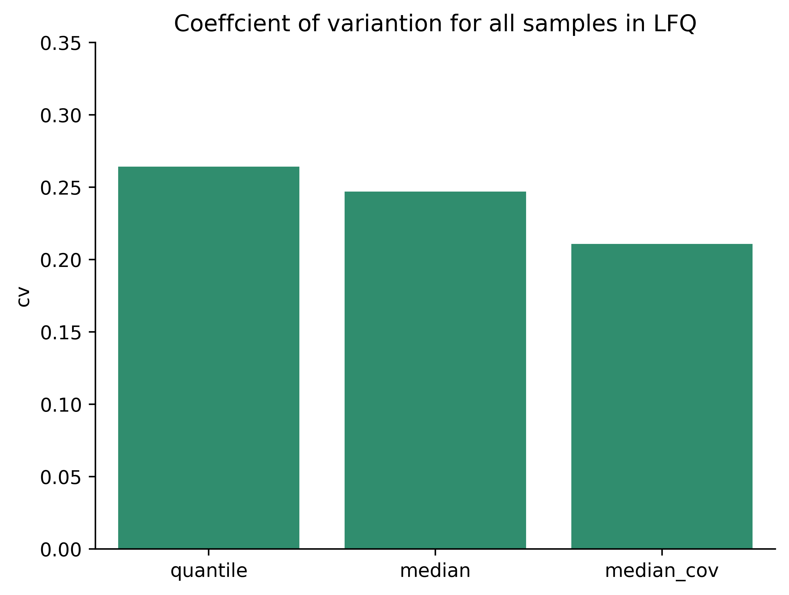
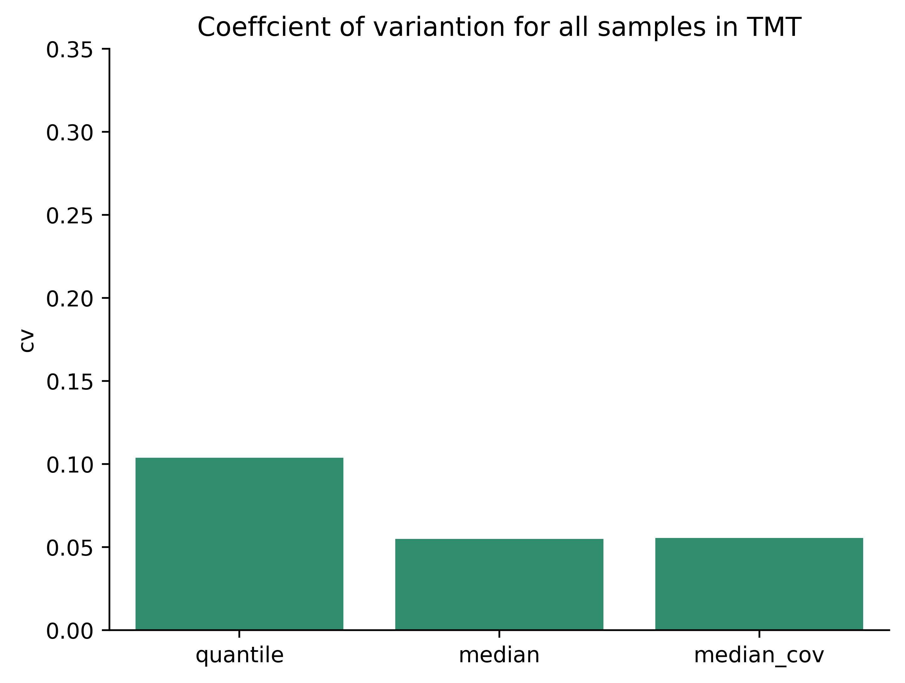

#### Variability of specific proteins across samples. 

Coefficient of variation of 30 proteins for all samples in both experiments using `quantile`, `median`, `median-cov`. We randomly selected 30 common proteins from IBAQ data from both experiments and then calculated their CV values in each of the 11 samples. In lfq experiment, `median-cov` did better.

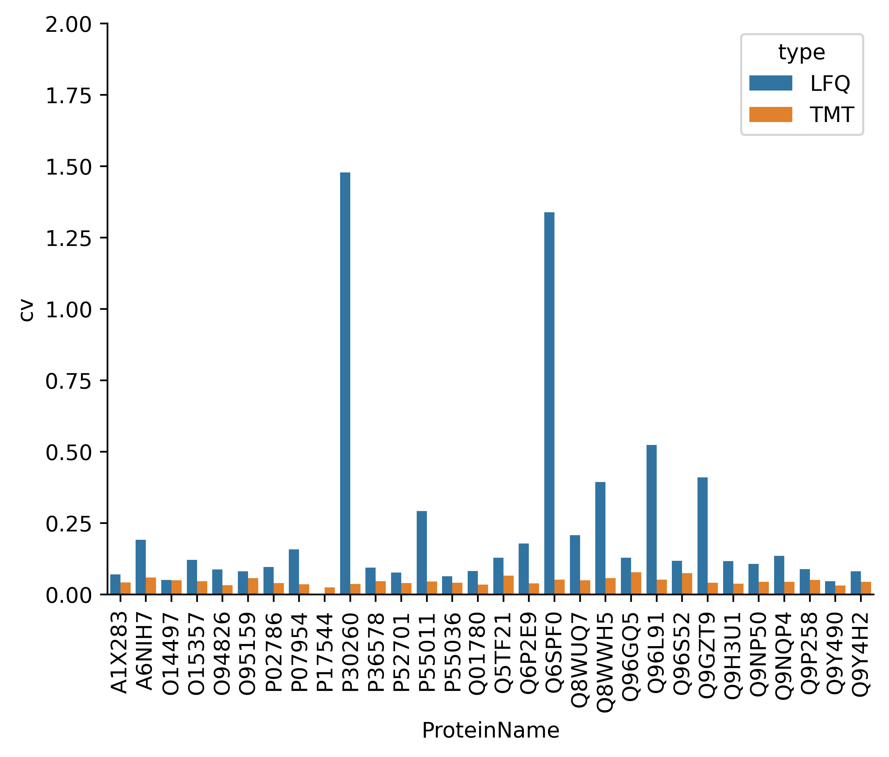
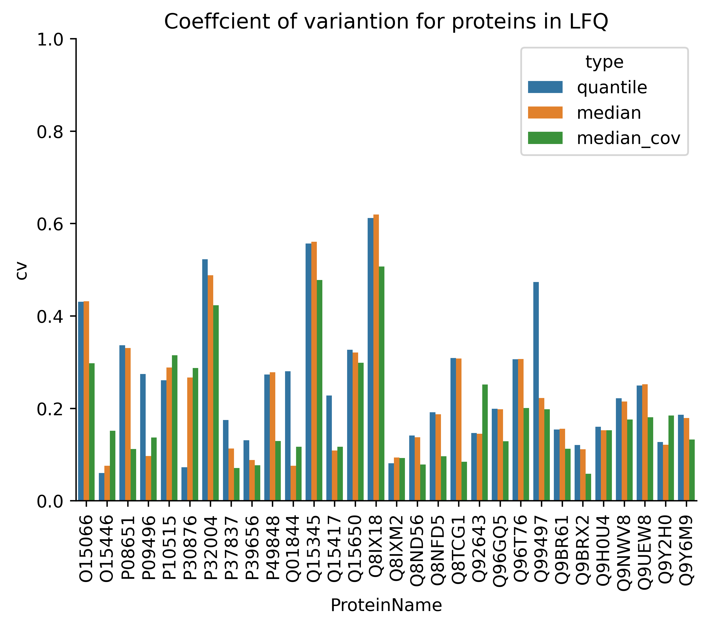

#### Correlation between TMT and LFQ samples

We calculated the correlation of ``log(rIBAQ)`` values for two experiments using ``median-cov``:

    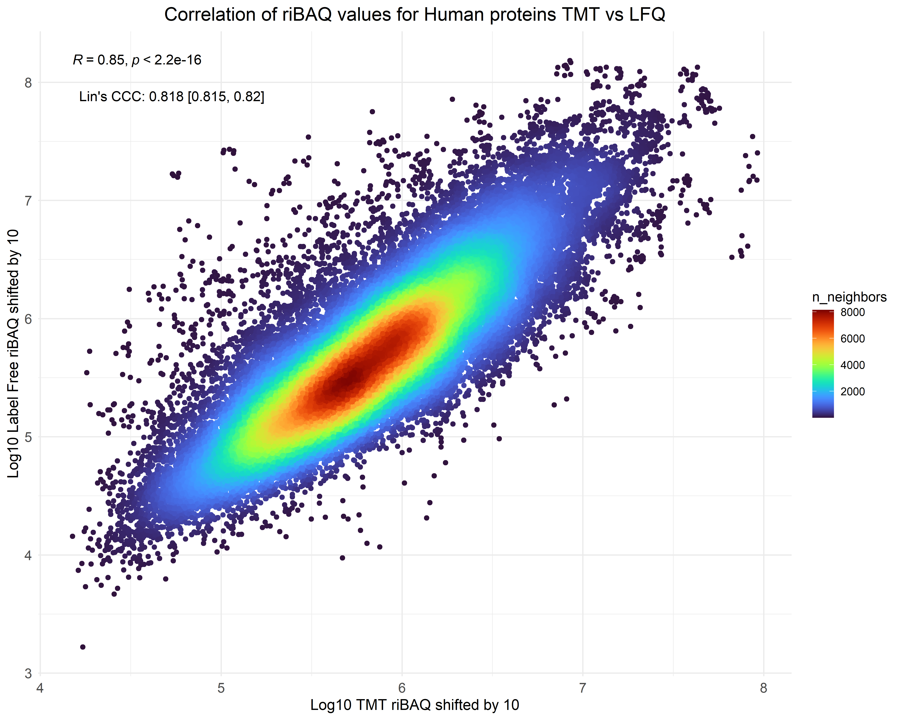

The previous plot explored the correlation of `rIbaq` values between both experiments TMT and LFQ using the `median-cov` method. In addition, we explored the correlation of `rIbaq` values between 11 samples in the two experiments. 

    

The following boxplot shows the coefficient of variation for the 11 samples for both experiments TMT and LFQ using the `median-cov` method. Results show that LFQ has a higher CV than TMT.

    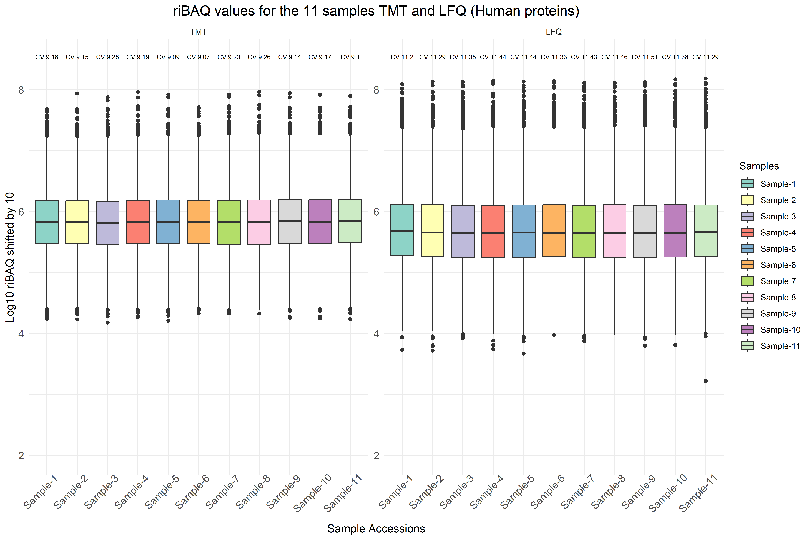

#### Correlation between Ibaq and MaxQuant(Ibaq)

For `PXD007683-LFQ`, we will normalize the MaxQuant Ibaq values of the proteins by dividing it by the total sum of that sample. Then compare the correlation between the log values of it and the log values of IbaqNorm.

    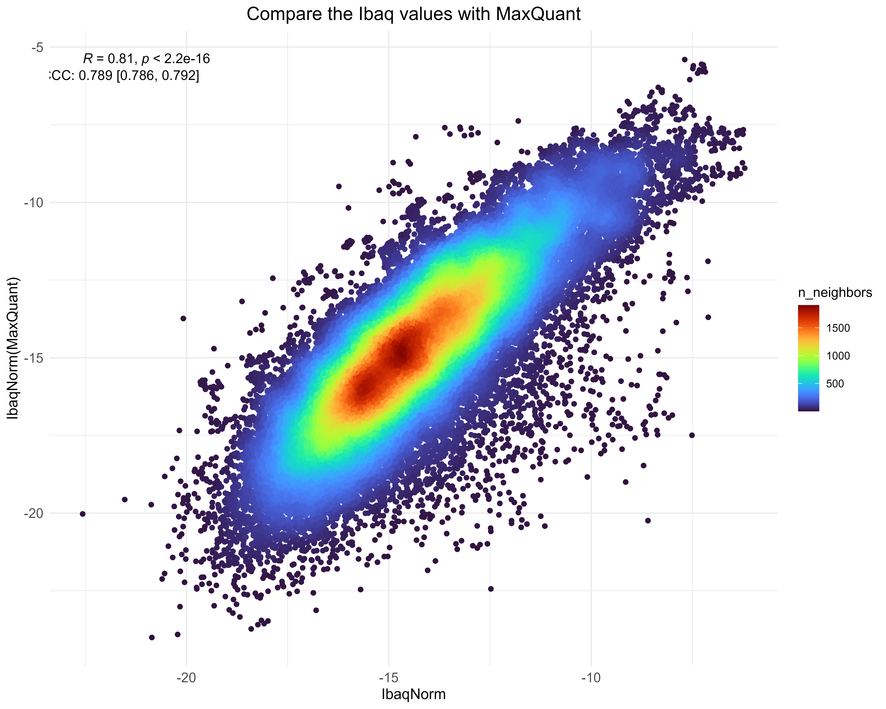

    

Next, for the peptide table of MaxQuant, we recalculated the Ibaq values using `ibaqpy`. Then compare the correlation between the log values of it and the log values of IbaqNorm.

    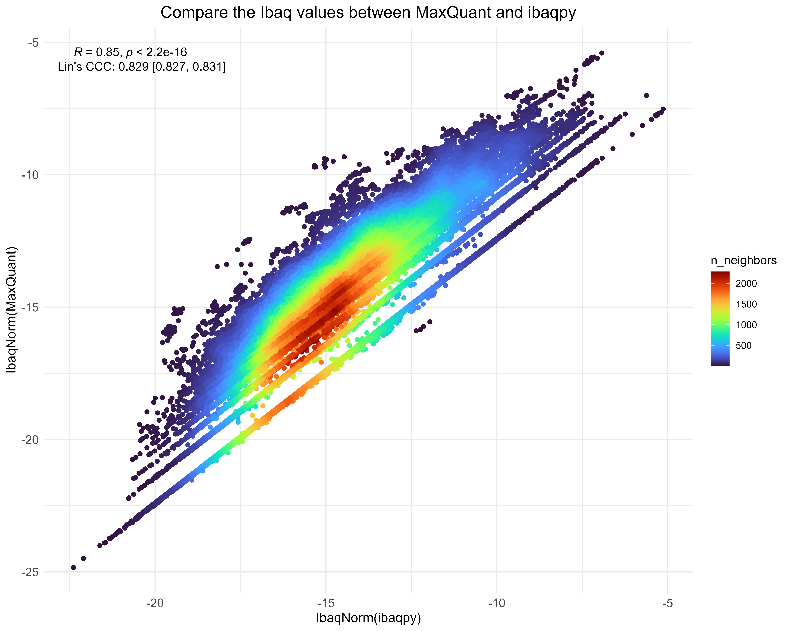

    

#### LFQ missing values 

Number of peptides missing in LFQ experiments.

    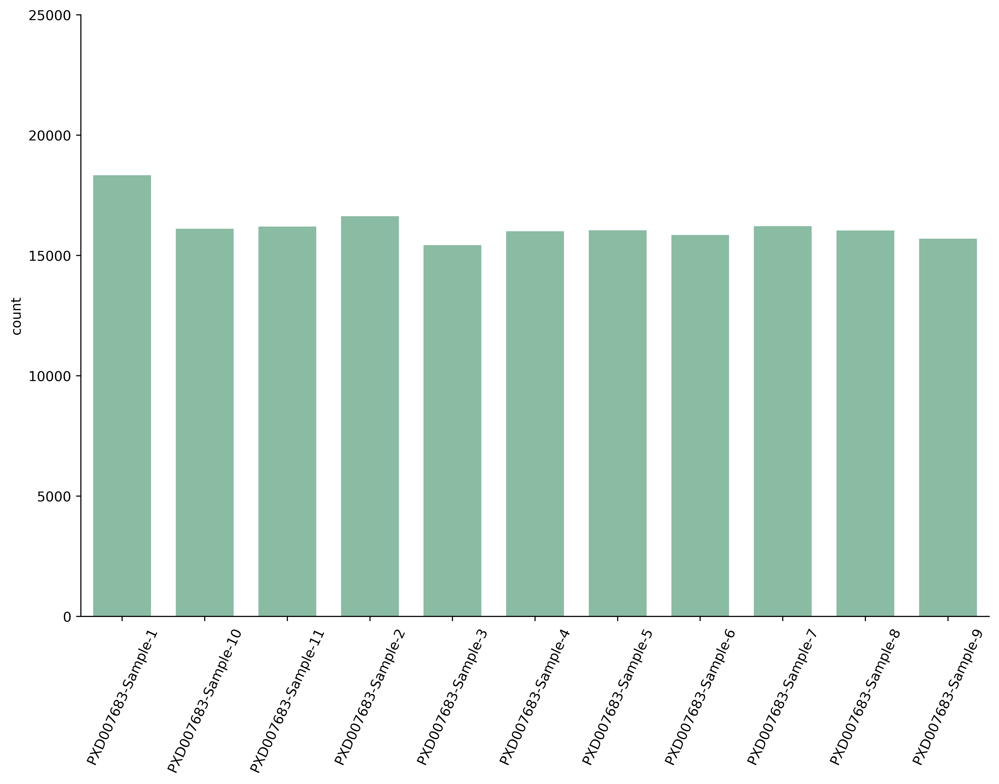

#### Fold-change detection 3-, 2-, and 1.5-fold. 

Using the `median-cov` approach, we extracted yeast proteins from the 11 samples from IBAQ data. The 11 samples were divided into three groups due to different yeast protein concentrations. ``1x-10%(1,2,3);2x-5%(4,5,6,7);3x-3.3%(8,9,10,11)`` We calculated the mean for the same protein in different samples under the same group, and then calculated the expression difference. 
-  3 fold-change: ``1x/3x``
-  2 fold-change: ``1x/2x``
-  1.5 fold-change: ``2x/1x``

- With median-cov, fold changes are well expressed.

<h3 align='center'>LFQ vs TMT</h3>

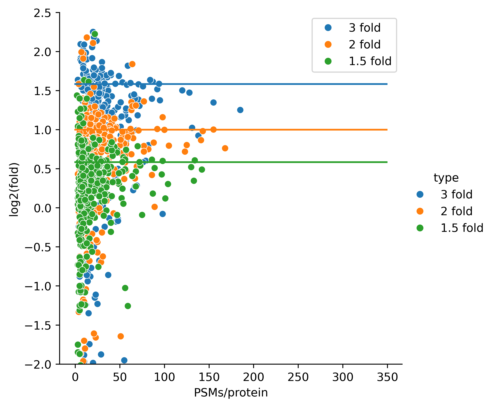
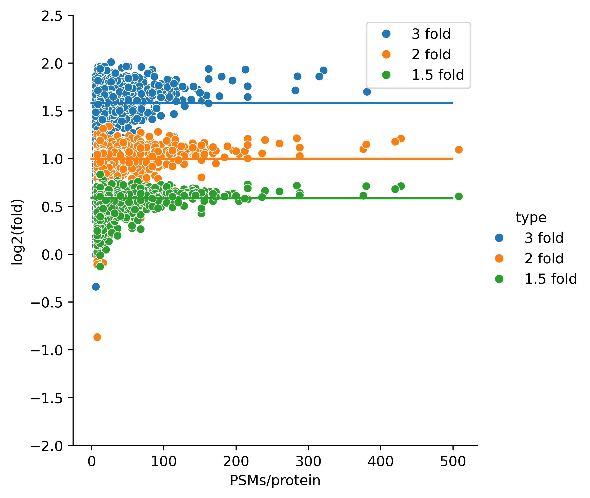

Similar to the original results from Gygi's lab, we found that both methods achieved comparably accurate estimates for all 3-fold-changes. However, TMT has a better performance that LFQ for all fold changes. 

### Datasets PXD010154 and PXD016999

In this second benchmark, we aim to test how ibaq values computed for different experiments and datasets correlate. The idea is to find out a method to quantify proteins that enable to integrate them in a single resource like https://quantms.org/baseline. We used the two largest tissue datasets in PRIDE database PXD010154 from Kuster Lab and PXD016999 from GTEX. In total, they study more than 30 tissues. Here we summarized both datasets: 

- [PXD010154](https://www.ebi.ac.uk/pride/archive/projects/PXD010154): The label-free dataset used in the manuscript is a comprehensive analysis of the proteome abundance of 29 healthy human tissues 22. In summary, the samples were collected from 13 male and 16 female healthy donors, and tryptic-peptide samples were analyzed in DDA mode generated using a Q-Exactive Plus mass spectrometer coupled online to a nanoflow LC system (NanoLC-Ultra). Peptides were fractionated via hydrophilic strong anion exchange (hSAX) offline chromatography, enabling deep tissue proteomic fractionation. The dataset was originally analyzed using ENSEMBL GRCh38 proteome using MaxQuant. We created a sample and data relationship format (SDRF) 31 file for the original dataset including the sample metadata, and data search settings including, for example, post-translational modifications, precursor and fragment tolerances [PXD010154 SDRF](https://ftp.pride.ebi.ac.uk/pub/databases/pride/resources/proteomes/absolute-expression/PXD010154/). 

- [PXD016999](https://www.ebi.ac.uk/pride/archive/projects/PXD016999): Additionally, we used an isobaric (TMT) dataset, a quantitative map of the human body that includes data from different tissues 23. The study quantitatively profiled the proteome of 201 samples from 32 different tissue types of 14 healthy individuals. This was achieved using a tandem mass tag (TMT) 10plex/MS3 mass spectrometry strategy, which allows 10 isotopically labelled samples to be analyzed together. To improve proteome coverage, each sample was extensively fractionated. Tissue samples were randomized across TMT 10plex groups for cross-tissue comparison and to minimize technical variations between mass spectrometry runs. The SDRF of the given datasets was annotated and deposited in two different files depending on the instrument used: 
  - [PXD016999-First Instrument](https://ftp.pride.ebi.ac.uk/pub/databases/pride/resources/proteomes/absolute-expression/PXD016999.1/) 
  - [PXD016999-Second Instrument](https://ftp.pride.ebi.ac.uk/pub/databases/pride/resources/proteomes/absolute-expression/PXD016999.2/) 

#### Coefficient of Variation (CV)

 For the DIA experiment of PXD016999, our **sdrf** only annotates experimental information from **skin**. We extract the shared proteins from all samples, calculate the coefficient of variation (CV) of these proteins across all samples, and then divide it by the number of proteins to obtain the average CV value.

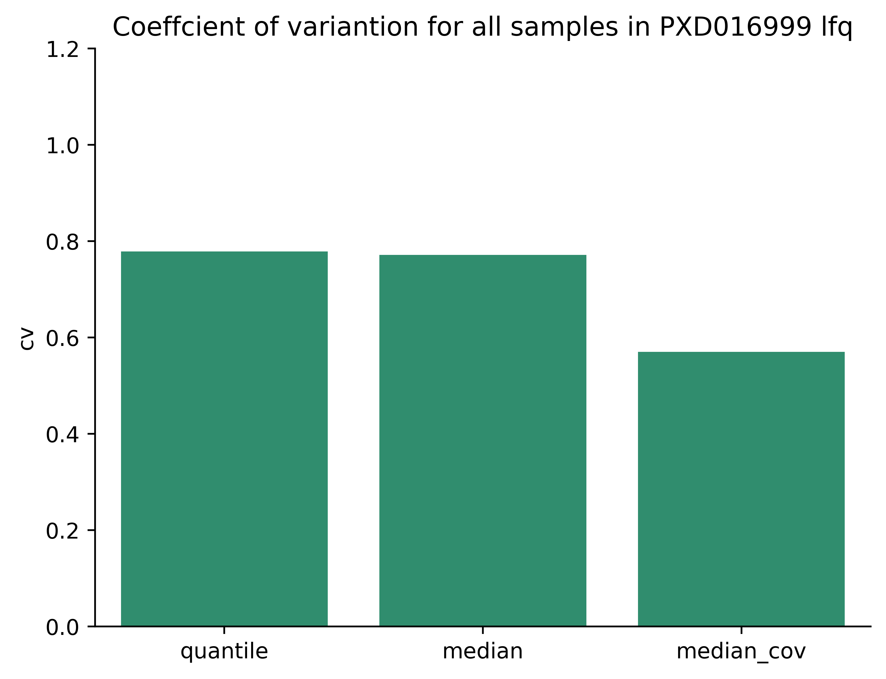

#### Variability of specific proteins across samples. 

For the DIA experiment of PXD016999, we randomly selected 30 common proteins from IBAQ data and then calculated their CV values in each of the skin samples.

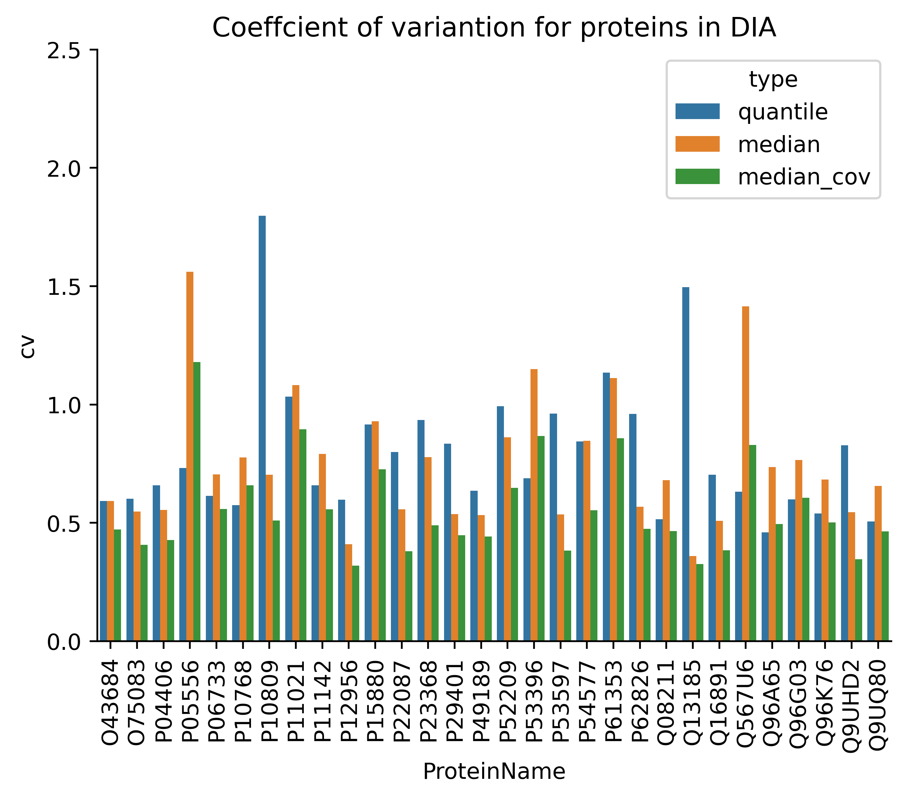

#### Missing values across samples

Number of peptides missing in the DIA experiment of PXD016999.1

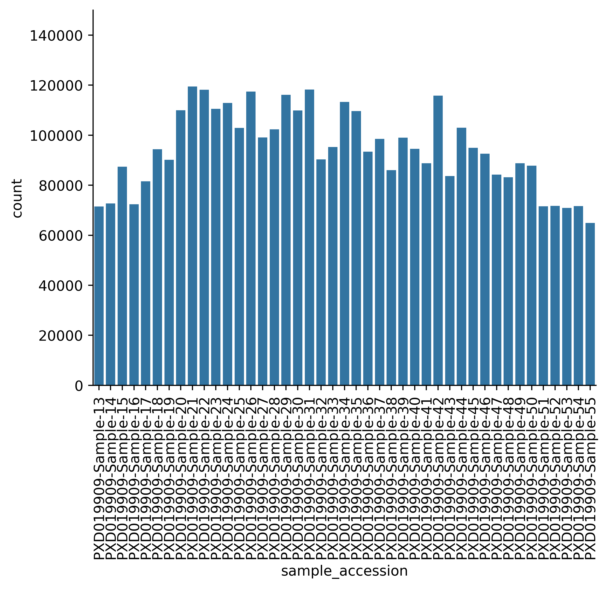

#### Correlation between MaxLFQ and Ibaq for the PXD016999.1
We will normalize the MaxLFQ values of the proteins in the DIANN report by dividing it by the total sum of that sample. Then compare the correlation between the log values of it and the log values of IbaqNorm.

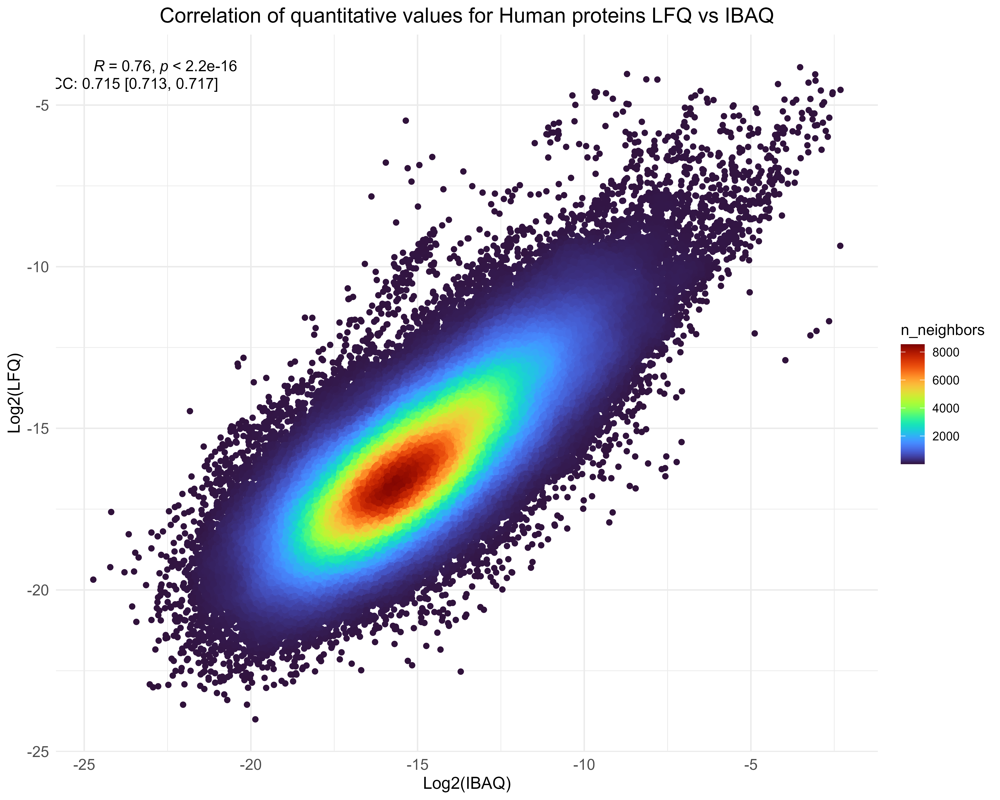

#### IbaqLog for 9 tissues shared between datasets PXD016999 and PXD010154.

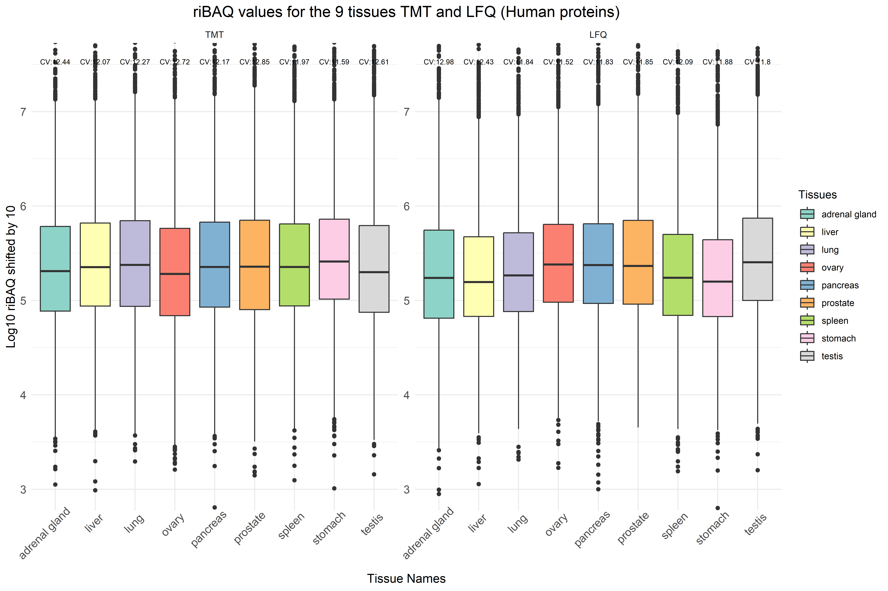

#### Correlation between riBAQ values for all quantified proteins between PXD016999 and PXD010154

### Performance testing

We have conducted performance tests on three methods. Since `median` and `median-cov` only differ when calculating ibaq, they are referred to as `median` below. It can be seen that the `median` is based on the sample level. It does not read all data at once like the `quantile`, but reads it in batches (by default, it reads 20 samples at a time), which greatly reduces memory consumption.

<table align="center">
    <thead>
        <tr>
            <th>Project</th>
            <th>File size(original)</th>
            <th>File size(transform)</th>
            <th>Ms runs</th>
            <th>Samples</th>
            <th>Method</th>
            <th>Memory</th>
            <th>Run time</th>
        </tr>
    </thead>
    <tbody>
        <tr>
            <td rowspan=2>PXD016999.1</td>
            <td rowspan=2>5.7 G</td>
            <td rowspan=2>292 M</td>
            <td rowspan=2>336</td>
            <td rowspan=2>280</td>
            <td>quantile</td>
            <td>36.4 G</td>
            <td>14 min</td>
        </tr>
        <tr>
            <td>median</td>
            <td>8.4 G</td>
            <td>20 min</td>
        </tr>
        <tr>
            <td rowspan=2>PXD019909</td>
            <td rowspan=2>1.9 G</td>
            <td rowspan=2>171 M</td>
            <td rowspan=2>43</td>
            <td rowspan=2>43</td>
            <td>quantile</td>
            <td>7.9 G</td>
            <td>30 s</td>
        </tr>
        <tr>
            <td>median</td>
            <td>4.0 G</td>
            <td>1.4 min</td>
        </tr>
        <tr>
            <td rowspan=2>PXD010154</td>
            <td rowspan=2>1.9 G</td>
            <td rowspan=2>287 M</td>
            <td rowspan=2>1367</td>
            <td rowspan=2>38</td>
            <td>quantile</td>
            <td>32.1 G</td>
            <td>8 min</td>
        </tr>
        <tr>
            <td>median</td>
            <td>16.2 G</td>
            <td>12 min</td>
        </tr>
        <tr>
            <td rowspan=2>PXD030304</td>
            <td rowspan=2>167 G</td>
            <td rowspan=2>15.8 G</td>
            <td rowspan=2>6862</td>
            <td rowspan=2>2013</td>
            <td>quantile</td>
            <td>> 128 G</td>
            <td>> 2 days</td>
        </tr>
        <tr>
            <td>median</td>
            <td>13.1 G</td>
            <td>2.75 h</td>
        </tr>
    </tbody>
</table>
