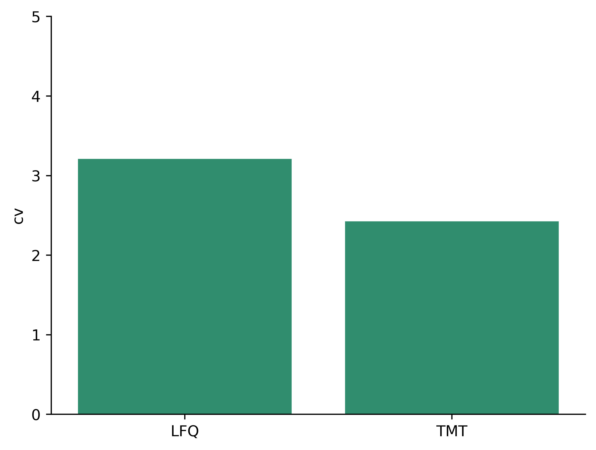
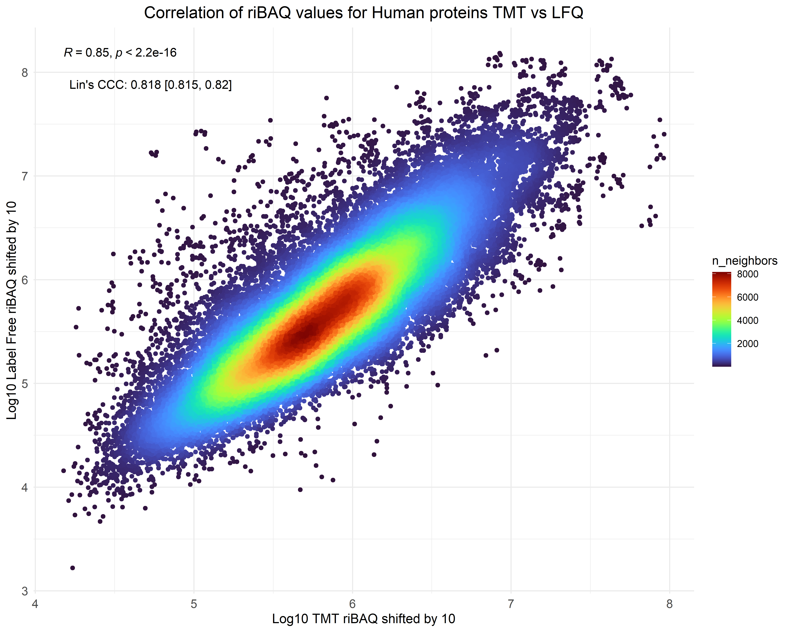
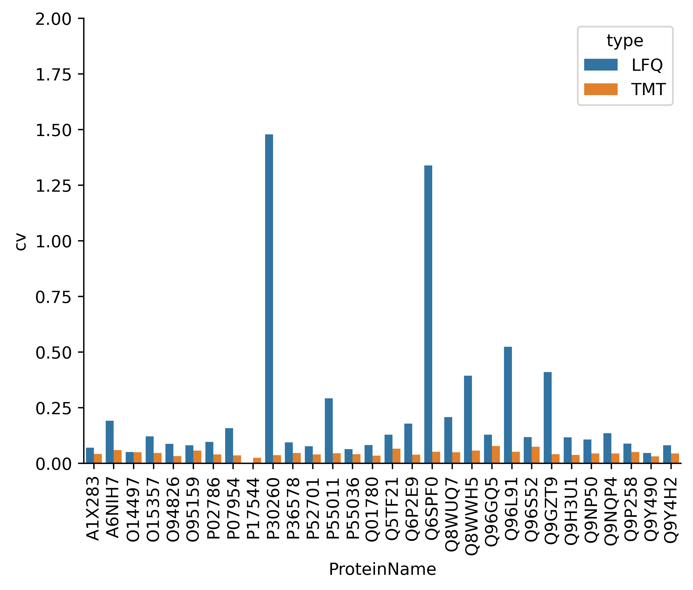
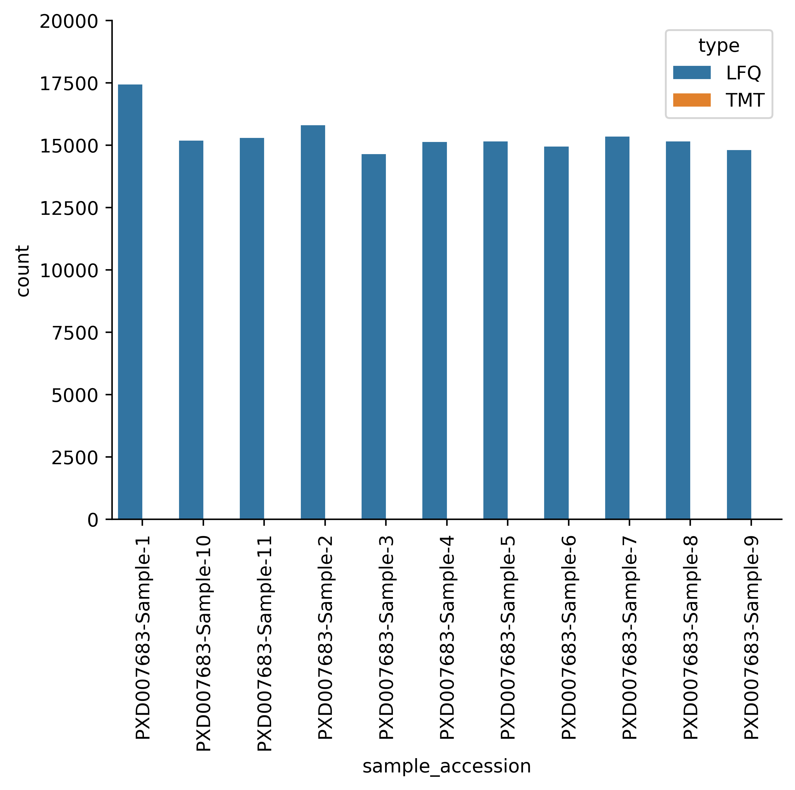
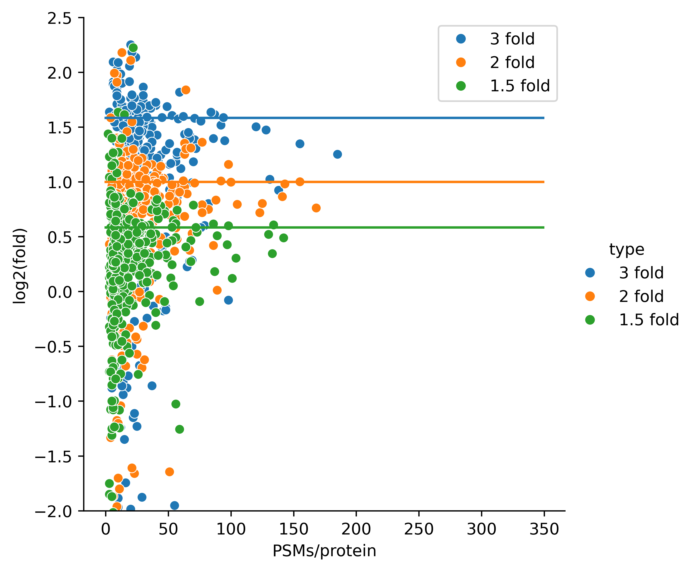
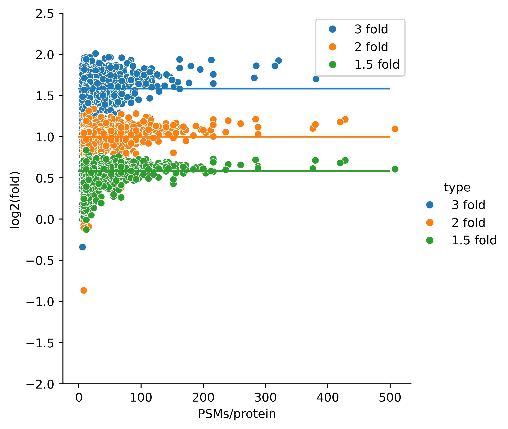

### ibaqpy - IBAQ Python benchmarks and tests 

This repository contains the benchmarks and tests for the IBAQ Python package (ibaqpy). The aim of this document is to provide a detailed description and documentation of different benchmarks on different datasets. An original benchmark of the package was published in [Proteomics in 2023](https://analyticalsciencejournals.onlinelibrary.wiley.com/doi/10.1002/pmic.202300188), but it was only aiming to demonstrate if the package and quantms could be used to analyze large-scale TMT and LFQ datasets. 

In these series of benchmarks, we aim to test the complete packages including the different methods for protein quantification, feature and peptide selection and normalization. Also, we aim to benchmark different metrics and parameters to remove low-quality features and peptides; and finally, we aim to test the performance of the package in different datasets. These are the following questions we aim to answer with these benchmarks:

- How does the package perform in different datasets?
- What method brings the less Coefficient of Variation (CV) in the quantification results across samples? 
- What method brings the best correlation between the ibaq values in TMT vs. LFQ?
- What method brings less missing values across samples?
- What method brings less technical variability across samples? 

last created: 2024-05-20 

### Dataset PXD007683

This dataset from Gygi's lab was originally published in JPR as [Proteome-Wide Evaluation of Two Common Protein Quantification Methods
](https://pubs.acs.org/doi/10.1021/acs.jproteome.8b00016). The dataset is available at [PXD007683](https://www.ebi.ac.uk/pride/archive/projects/PXD007683).
The authors test the ability of two common methods, a tandem mass tagging (TMT) method and a label-free quantitation method (LFQ), to achieve comprehensive quantitative coverage by benchmarking their capacity to measure 3 different levels of change (3-, 2-, and 1.5-fold) across an entire data set. The authors reported Both methods achieved comparably accurate estimates for all 3-fold-changes. 

We analyzed the dataset using [quantms workflow](https://github.com/bigbio/quantms), results for both TMT and LFQ are available at: 

- [PXD007683-TMT](https://ftp.pride.ebi.ac.uk/pub/databases/pride/resources/proteomes/quantms-benchmark/PXD007683-TMT/).
- [PXD007683-LFQ](https://ftp.pride.ebi.ac.uk/pub/databases/pride/resources/proteomes/quantms-benchmark/PXD007683-LFQ/).

In summary, both datasets were search with three search engines SAGE, COMET and MSGF+ and the results were combined with ConsesusID and PSMs and proteins were filtered with a 1% FDR. The quantification was performed with the quantms workflow using the ibaq method. Some general statistics: 

- TMT: 11 samples, 9423 proteins, 77439 peptides, 1409771 features, 139891 PSMs. 
- LFQ: 11 samples, 8213 proteins, 54939 peptides, 505906 features, 533910 PSMs.

#### Coefficient of Variation (CV)

</img>

#### Correlation between TMT and LFQ samples

</img>

</img>

</img>

#### Variability of specific proteins across samples. 

</img>

#### Missing values across samples

</img>

#### Fold-change detection 3-, 2-, and 1.5-fold. 

<h3 style="text-align:center;">LFQ</h3>

</img>

<h3 style="text-align:center;">TMT</h3>

</img>

### Datasets PXD010154 and PXD016999

The datasets PXD010154 and PXD016999 are the largest human tissue datasets in public proteomics respositories. In total they study more than 30 tissues. Here is a resume of both datasets: 

[PXD010154](https://www.ebi.ac.uk/pride/archive/projects/PXD010154): The label-free dataset used in the manuscript is a comprehensive analysis of the proteome abundance of 29 healthy human tissues 22. In summary, the samples were collected from 13 male and 16 female healthy donors, and tryptic-peptide samples were analyzed in DDA mode generated using a Q-Exactive Plus mass spectrometer coupled online to a nanoflow LC system (NanoLC-Ultra). Peptides were fractionated via hydrophilic strong anion exchange (hSAX) offline chromatography, enabling deep tissue proteomic fractionation. The dataset was originally analyzed using ENSEMBL GRCh38 proteome using MaxQuant. We created a sample and data relationship format (SDRF) 31 file for the original dataset including the sample metadata, and data search settings including, for example, post-translational modifications, precursor and fragment tolerances [PXD010154 SDRF](https://ftp.pride.ebi.ac.uk/pub/databases/pride/resources/proteomes/absolute-expression/PXD010154/). 

[PXD016999](https://www.ebi.ac.uk/pride/archive/projects/PXD016999): Additionally, we used an isobaric (TMT) dataset, a quantitative map of the human body that includes data from different tissues 23. The study quantitatively profiled the proteome of 201 samples from 32 different tissue types of 14 healthy individuals. This was achieved using a tandem mass tag (TMT) 10plex/MS3 mass spectrometry strategy, which allows 10 isotopically labelled samples to be analyzed together. To improve proteome coverage, each sample was extensively fractionated. Tissue samples were randomized across TMT 10plex groups for cross-tissue comparison and to minimize technical variations between mass spectrometry runs. The SDRF of the given datasets was annotated and deposited in two different files depending on the instrument used: 
 - [PXD016999-First Instrument](https://ftp.pride.ebi.ac.uk/pub/databases/pride/resources/proteomes/absolute-expression/PXD016999.1/) 
 - [PXD016999-Second Instrument](https://ftp.pride.ebi.ac.uk/pub/databases/pride/resources/proteomes/absolute-expression/PXD016999.2/) 

#### Coefficient of Variation (CV)

#### Correlation between TMT and LFQ samples

#### Variability of specific proteins across samples. 

#### Missing values across samples