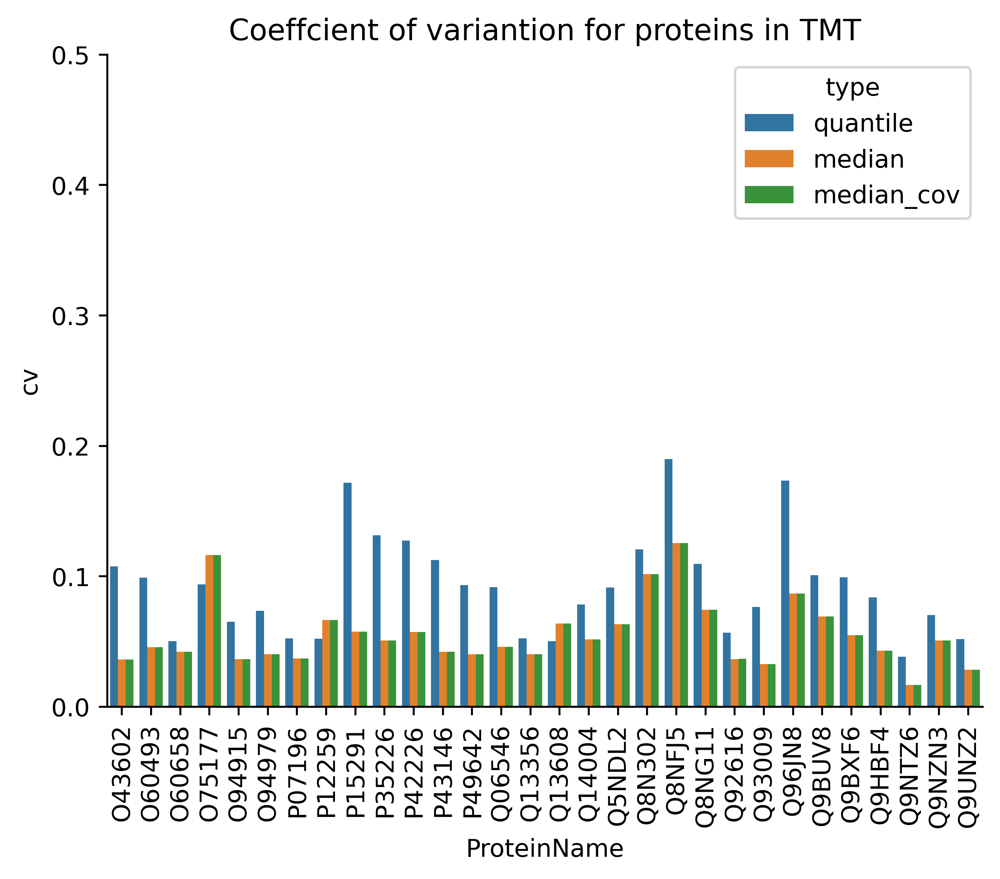

### ibaqpy - IBAQ Python benchmarks and tests 

last update: 2024-05-29  

This repository contains the benchmarks and tests for the IBAQ Python package [ibaqpy](https://github.com/bigbio/ibaqpy). The aim of this document is to provide a detailed description and documentation of different benchmarks on different datasets. An original benchmark of the package was published in [Proteomics in 2023](https://analyticalsciencejournals.onlinelibrary.wiley.com/doi/10.1002/pmic.202300188), but it was only aimed to demonstrate if the package and quantms could be used to analyze large-scale TMT and LFQ datasets. 

In these series of benchmarks, we aim to test the complete package including the different methods for protein quantification, feature and peptide selection and normalization. Also, we aim to benchmark different metrics and parameters to remove low-quality features and peptides; and finally, we aim to test the performance of the package in different datasets. These are the following questions we aim to answer with these benchmarks:

- How does the package perform in different datasets?
- What method brings the less Coefficient of Variation (CV) in the quantification results across samples? 
- What method brings the best correlation between the ibaq values in TMT vs. LFQ?
- What method brings less missing values across samples?
- What method brings less technical variability across samples?

### Dataset PXD007683

This dataset from Gygi's lab was originally published in JPR as [Proteome-Wide Evaluation of Two Common Protein Quantification Methods
](https://pubs.acs.org/doi/10.1021/acs.jproteome.8b00016). The dataset is available at [PXD007683](https://www.ebi.ac.uk/pride/archive/projects/PXD007683).
The authors test the ability of two common methods, a tandem mass tagging (TMT) method and a label-free quantitation method (LFQ), to achieve comprehensive quantitative coverage by benchmarking their capacity to measure 3 different levels of change (3-, 2-, and 1.5-fold) across an entire data set. The authors reported Both methods achieved comparably accurate estimates for all 3-fold-changes. 

We analyzed the dataset using [quantms workflow](https://github.com/bigbio/quantms), results for both TMT and LFQ are available at: 

- [PXD007683-TMT](https://ftp.pride.ebi.ac.uk/pub/databases/pride/resources/proteomes/quantms-benchmark/PXD007683-TMT/).
- [PXD007683-LFQ](https://ftp.pride.ebi.ac.uk/pub/databases/pride/resources/proteomes/quantms-benchmark/PXD007683-LFQ/).

In summary, both datasets were searched with three search engines SAGE, COMET and MSGF+, and the results were combined with ConsesusID and PSMs and proteins were filtered with a 1% protein and PSM FDR. The quantification was performed with the quantms workflow using the ibaqpy method. Some general statistics:

| Method | Samples | Proteins | Peptides | Features | PSMs    |
|--------|---------|----------|----------|----------|---------|
| TMT    | 11      | 9423     | 77439    | 1409771  | 139891  |
| LFQ    | 11      | 8213     | 54939    | 505906   | 533910  |

#### Coefficient of Variation (CV)

Coefficient of variation for all samples in both experiments using quantile, median, median-cov.
We extracted human proteins common to 11 samples from IBAQ data.
The mean of the coefficient of variation of all proteins in 11 samples was then calculated.

> Note:  

Compared to the quantile, median and median-cov has a smaller coefficient of variation.
Medien-cov has the smallest CV in the lfq experiment.

#### Variability of specific proteins across samples. 

Coefficient of variation of 30 proteins for all samples in both experiments using quantile, median, median-cov. We randomly selected 30 common proteins from IBAQ data from both experiments and then calculated their CV values in each of the 11 samples. In lfq experiment, median-cov did better.

#### Correlation between TMT and LFQ samples

We calculated the correlation of ``IBAQlog`` values for two experiments using ``median-cov``. They have a strong correlation.

    </img>
    </img>

Correlation of ``IBAQlog`` values between 11 samples in the two experiments.

    </img>

#### Missing values across samples

Number of peptide missings in both experiments. Compared to TMT, LFQ has a lot of missing values.

    </img>

#### Fold-change detection 3-, 2-, and 1.5-fold. 

Using the median-cov approach, we extracted yeast proteins common to 11 samples from IBAQ data. The 11 samples were divided into three groups due to different yeast protein concentrations. ``1x-10%(1,2,3);2x-5%(4,5,6,7);3x-3.3%(8,9,10,11)`` We calculated the mean for the same protein in different samples under the same group, and then calculated the expression difference. 
-  3 fold-change: ``1x/3x``
-  2 fold-change: ``1x/2x``
-  1.5 fold-change: ``2x/1x``
With median-cov, fold changes are well expressed.

<!-- 

    

        <h3 style="text-align:center;">LFQ</h3>
        </img>
    

    

        <h3 style="text-align:center;">TMT</h3>
        </img>
    

 -->

<h3 align='center'>LFQ vs TMT</h3>

</img></img>

### Datasets PXD010154 and PXD016999

The datasets PXD010154 and PXD016999 are the largest human tissue datasets in public proteomics respositories. In total they study more than 30 tissues. Here is a resume of both datasets: 

[PXD010154](https://www.ebi.ac.uk/pride/archive/projects/PXD010154): The label-free dataset used in the manuscript is a comprehensive analysis of the proteome abundance of 29 healthy human tissues 22. In summary, the samples were collected from 13 male and 16 female healthy donors, and tryptic-peptide samples were analyzed in DDA mode generated using a Q-Exactive Plus mass spectrometer coupled online to a nanoflow LC system (NanoLC-Ultra). Peptides were fractionated via hydrophilic strong anion exchange (hSAX) offline chromatography, enabling deep tissue proteomic fractionation. The dataset was originally analyzed using ENSEMBL GRCh38 proteome using MaxQuant. We created a sample and data relationship format (SDRF) 31 file for the original dataset including the sample metadata, and data search settings including, for example, post-translational modifications, precursor and fragment tolerances [PXD010154 SDRF](https://ftp.pride.ebi.ac.uk/pub/databases/pride/resources/proteomes/absolute-expression/PXD010154/). 

[PXD016999](https://www.ebi.ac.uk/pride/archive/projects/PXD016999): Additionally, we used an isobaric (TMT) dataset, a quantitative map of the human body that includes data from different tissues 23. The study quantitatively profiled the proteome of 201 samples from 32 different tissue types of 14 healthy individuals. This was achieved using a tandem mass tag (TMT) 10plex/MS3 mass spectrometry strategy, which allows 10 isotopically labelled samples to be analyzed together. To improve proteome coverage, each sample was extensively fractionated. Tissue samples were randomized across TMT 10plex groups for cross-tissue comparison and to minimize technical variations between mass spectrometry runs. The SDRF of the given datasets was annotated and deposited in two different files depending on the instrument used: 
 - [PXD016999-First Instrument](https://ftp.pride.ebi.ac.uk/pub/databases/pride/resources/proteomes/absolute-expression/PXD016999.1/) 
 - [PXD016999-Second Instrument](https://ftp.pride.ebi.ac.uk/pub/databases/pride/resources/proteomes/absolute-expression/PXD016999.2/) 

#### Coefficient of Variation (CV)

For the DIA experiment of PXD016999, all samples were from **skin** tissue.

#### Variability of specific proteins across samples. 

#### Missing values across samples

#### Correlation between MaxLFQ and Ibaq for the PXD016999.1
We will normalize the MaxLFQ values of the proteins in the DIANN report by dividing it by the total sum of that sample.Then compare the correlation between the log values of it and the log values of IbaqNorm.

#### IbaqLog for 9 tissues shared between datasets PXD016999 and PXD010154.

#### Correlation between riBAQ values for all quantified proteins between PXD016999 and PXD010154

